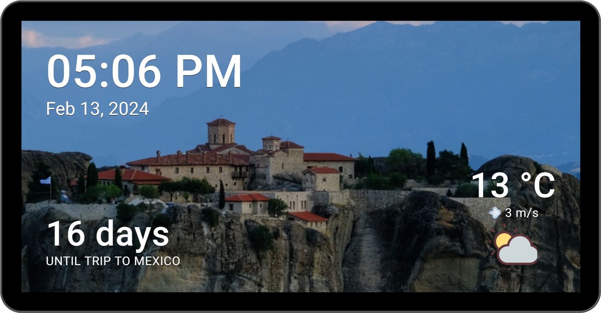

# Welcome to Android Digital Photo Album! 🎉

I'm thrilled you're exploring this Open Source app designed to **breathe new life into your old
Android devices** by transforming them into digital photo album, with a few extra features.
This project's commitment to Open Source means you get a product built on transparency, community-driven enhancements, and trust.

I've started this project out of a personal need for a privacy-respecting digital photo album app.
It's built with zero tracking and no unnecessary sales pitches - just a straightforward, useful app.

## Screenshots 📸

## Getting Started 🚀

To get started, you can build it yourself from the source code, or you can download the APK directly
from the [Releases](https://github.com/pedronveloso/android-digital-frame/releases) page.

### Building the app

To build the app, you'll need to have [Android Studio](https://developer.android.com/studio) installed. Once you have it, you can clone the repository and open it in Android Studio.
The project doesn't require any special setup, so you should be able to build and run it right away. 

## Features 🍰

 - **Privacy-focused**: No tracking, no ads, no unnecessary permissions.
 - **Made for AMOLED screens**: The uses animations, text relocation and HUD transparency to reduce the risk of screen burn-in. This happens by default, and is especially important for preserving AMOLED screens.
 - **Always on display**: The app can be used as an always-on display.
 - **Fully native**: The app is built using Kotlin and the Android SDK. That means it's lightweight and fast.
 - **Minimal network usage**: The app only uses the network when it needs to update the weather. It doesn't use the network for tracking or analytics. You can even use it without an internet connection at all if you want (obviously weather status won't display if so).

### Existing "plugins" 🧩

- **Background photos**: You can pick the photos you want to display on your digital photo album.
  The photos will be displayed in a random order using transition animations.
 - **Orientation support**: You can use the app in portrait or landscape mode.
 - **Date & Time**: You can display the current date and time on the screen.
 - **Weather**: You can display the current weather on the screen.
 - **Countdown message**: You can display an optional countdown message on the screen for events that are meaningful to you.

➡️ With time, I plan to add more features to the app. If you have any suggestions, feel free to open an issue or a pull request.

## Contributing: Join Our Journey! 🌟

Your contributions can help keep Android Digital Photo Album thriving. Whether through code,
feedback, or sponsorship, your support is invaluable.

- You can find a link to my Ko-fi page here on the GitHub page. This is a great way to support the
  project by doing a one-time or recurring donation.
 - If you'd like to contribute with code or language support, just open a PR. Feel free to message me by opening a new issue if you have any questions.

Let's keep this project free and accessible for all!

## License 📜

This project is licensed under the GNU General Public License v3.0 - see the [LICENSE](LICENSE) file
for details.
